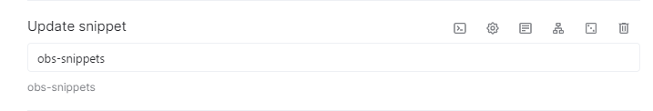
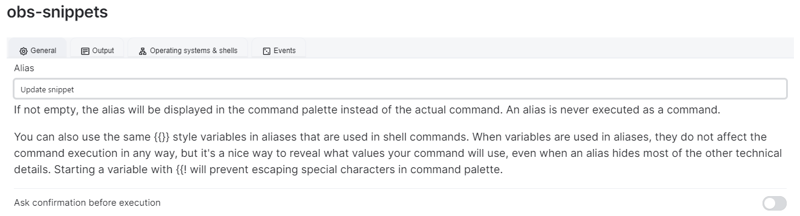
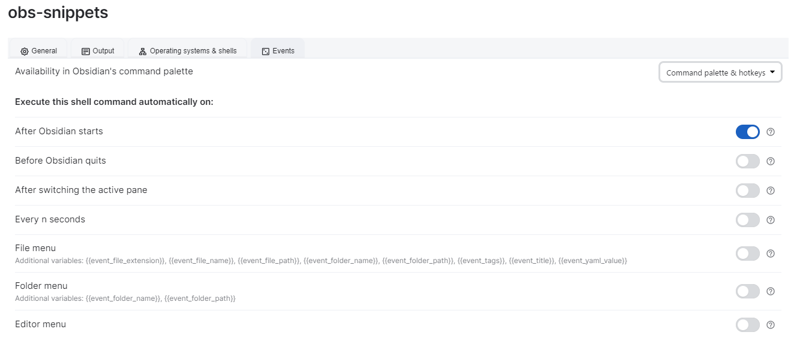

Obsidian Snippet Manager is a python script that git pull and move CSS file in your `.obsidian/snippet` folder.

The goal is to provide a pratical way to get semi-auto-update from css snippet hosted on github, in waiting of an eventually BRAT update that support that.

# Get started
## Requirements
1. [Git](https://git-scm.com/downloads)
2. [Python](https://www.python.org/downloads/)
3. `pip install obs-snippets`

## Environment
The plugin needs :
- The **absolute** path of your vault, as : `G:\Drive\Vault`
- A folder that contains **all** the snippet you want to get the update.
This folder can be everywhere on your computer (yes, it can be in `.obsidian` too.). It will contain all folder of the snippet hosted on GitHub you want to use.  
    _In case of the folder doesn't exist, the script will create it !_

## How to use
1. Adding a new repo : `obsnipe --add repository_url`
2. Updating everything : `obsnipe`
3. Updating only a repository : `obsnipe --update folder_name` 
    The foldername is the folder that you want to update the snippet !

The script will :
- Git pull 
- Git move every `.css` file in your `.obsidian/snippet` folder. 

## Other function
- `obsnipe --list` : List all Github Repository you download.
- 

# Example 
*Using [Obsidian Snippets Collection](https://github.com/Mara-Li/Obsidian-Snippet-collection)*
1. Configuration : 
    - Vault is in : `G:/Drive/vault`
    - My Obsidian Manager Folder is in : `D:/Documents/Github/Snippets Manager`
2. `obsnipe --add https://github.com/Mara-Li/Obsidian-Snippet-collection`
3. Active the snippets 🎉

To update this specific snippet : `obs-snippets --update Obsidian-Snippet-collection`

# In obsidian 

You can create a commmand in Obsidian using [Obsidian Shell](https://github.com/Taitava/obsidian-shellcommands).

*Bonus, you can update your snippet everytime obsidian start, like BRAT !*

⚠️ **WARNING** : Every edit on snippet downloaded by this way will break the script. Please, DON'T EDIT these file, and use another snippet ! (Or, use a fork and commit before !)