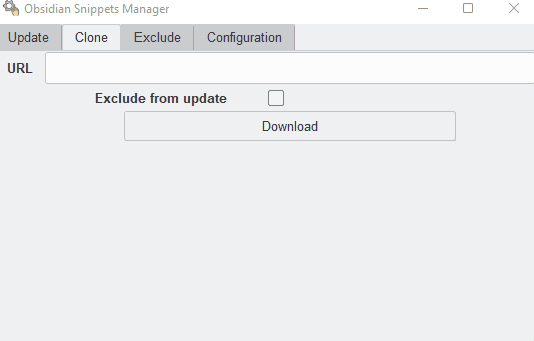

Obsidian Snippet Manager is a python script that git pull and move CSS file in your `.obsidian/snippet` folder.

The goal is to provide a practical way to get semi-auto-update from CSS snippet hosted on GitHub, in waiting of an eventual BRAT update that support that.

# Get started
## Requirements
1. [Git](https://git-scm.com/downloads)
2. [Python](https://www.python.org/downloads/)
3. `pip install Obsidian-Snippet-Manager --upgrade`

# GUI


You can use the application with an interface, using (in terminal): `snipetter`.

Information about [executable release](https://github.com/Mara-Li/Obsidian-Snippet-Manager/releases):
- It will don't install the CLI command, so you won't have the [Obsidian-Shell auto-update](README.md#in-obsidian).
- The executable don't use the same environment file as the package : You need to configure two times if you use the two (CLI + executable released)
- Delete the release delete the environment file. Beware when you update your executable.

You can select the files you want to update or clone. Also, you can exclude specific file from update, instead of entire folder.
Note : When you clone a repo, select some files don't exclude them. If you **really** don't want them, exclude them using the tab exclude. 

---

# CLI
## Environment
The plugin needs :
- The **absolute** path of your vault, as : `G:\Drive\Vault`
- A folder that contains **all** the snippet you want to get the update.
This folder can be everywhere on your computer (yes, it can be in `.obsidian` too.). It will contain all folder of the snippet hosted on GitHub you want to use.  
    _In case of the folder doesn't exist, the script will create it!_

## How to use
1. Adding a new repo : `obsnipe clone repository_url`  
    Additionally, you can exclude a folder from update with adding the `--exclude` command : `obsnipe clone [repository_url] --excluded`  
    This command work also for file : `obsnipe clone [repository_url] --excluded file.css`. This file will be added to `exclude.yml`. 
2. Updating everything : `obsnipe`
3. Updating only a repository : `obsnipe update folder_name` 
    The folder name is the folder that you wish to update the snippet!  
    Also, you can update only a specific file with `obsnipe update [foldername] --only [filename]`

The script will :
- Git pull 
- Git move every `.css` (unless the excluded) file in your `.obsidian/snippet` folder.

## Other function
- `obsnipe list` : List all GitHub Repository you download.
- `obsnipe exclude [folder_name]` : Exclude a folder or a css snippet from update. You can exclude multiple value using : `obsnipe exclude [folder1] [filename2]`

Note : You can exclude a folder from auto-update using the `exclude.yml` file, placed in your Snippet Manager folder. 
You need to add the folder name as a yaml list :
```yml
- foldername1
- foldername2
```

# Example 
*Using [Obsidian Snippets Collection](https://github.com/Mara-Li/Obsidian-Snippet-collection)*
1. Configuration : 
    - Vault is in : `G:/Drive/vault`
    - My Obsidian Manager Folder is in : `D:/Documents/Github/Snippets Manager`
2. `obsnipe clone https://github.com/Mara-Li/Obsidian-Snippet-collection`
3. Activate the snippets 🎉

To update this specific snippet : `obsnipe update Obsidian-Snippet-collection`

# In obsidian

You can create a command in Obsidian using [Obsidian Shell](https://github.com/Taitava/obsidian-shellcommands).


*Bonus, you can update your snippet every time obsidian start, like BRAT!*

⚠️ **WARNING** : Every edit on a snippet downloaded by this way will break the script. Please, DON'T EDIT these file, and use another snippet. (Or, use a fork and commit before.)

# Credit
- <a href="https://www.flaticon.com/free-icons/manual" title="manual icons">Manual icons created by LAFS - Flaticon</a>
- [Boxicon](https://boxicons.com/)
